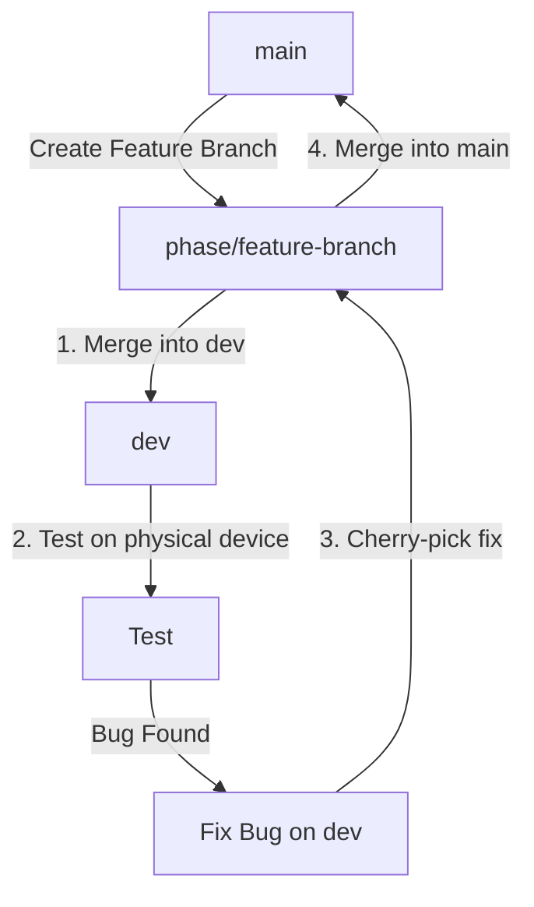

# Appace — Git Workflow & Branch Management

This document defines the exact workflow for managing branches, testing features, resolving bug fixes on the `dev` branch, and merging changes to the stable `main` branch.

---

## 1. Branch Roles

* **`main`**: Stable, production-ready code. **Never commit directly to `main`.**
* **`dev`**: Integration and active testing branch. Used for physical device deployment and dev-only testing utilities. **Never merge `dev` directly into `main`** (to avoid merging dev-only tools).
* **Feature Branches (`phase/*`)**: Component-specific work (e.g. `phase6/timer-accuracy-fix`, `phase7/testing`). Created off `main` (or parent phase), merged to `dev` for testing, and finally merged to `main` once verified.

---

## 2. Typical Feature & Testing Lifecycle



### Step 1: Create a Feature Branch
All work starts on a feature branch created from `main`:
```bash
git checkout main
git pull
git checkout -b phase/my-new-feature
```

### Step 2: Test on the `dev` Branch
To verify changes on a device or emulator, merge your feature branch into `dev` and compile the build:
```bash
# Switch to dev and merge the feature branch
git checkout dev
git pull
git merge phase/my-new-feature

# Compile and run your tests/builds on dev
```

### Step 3: Handle Bug Fixes Found During Testing
If a bug is identified during testing on `dev`, fix it directly on `dev` to keep testing going:
1. Make the fix on `dev` and commit it (e.g., `git commit -m "[phase7] fix critical bug"`).
2. Get the commit hash: `git log -n 1 --oneline` (e.g., `a1b2c3d`).
3. Switch back to your original feature branch and cherry-pick the fix:
   ```bash
   git checkout phase/my-new-feature
   git cherry-pick a1b2c3d
   ```
4. Resolve any conflicts if they arise, then complete the cherry-pick (`git cherry-pick --continue`).

### Step 4: Merge Completed Feature to `main`
Once the feature branch contains all completed code and cherry-picked bug fixes, merge it into `main` (not the `dev` branch!):
```bash
git checkout main
git pull
git merge phase/my-new-feature
git push
```

---

## 3. Active Working Tree Reference
Ensure that before merging or switching branches, your working tree is clean to prevent uncommitted changes from leaking between environments. 

* **To check status**: `git status`
* **To discard temporary changes**: `git restore .` (or `git stash` to save them temporarily)

---

## 4. Parallel Branch Management & One-Way Syncing

To run the clean production branch (`main`) and the developer sandbox (`dev`) in parallel without polluting production with dev tools, adhere to the following rules:

### Rule 1: One-Way Flow (main → dev)
Information should only flow from `main` to `dev`, never backwards:
1. When any feature or bug fix is merged into `main`, immediately switch to `dev` and merge `main` in:
   ```bash
   git checkout dev
   git merge main
   ```
2. This ensures `dev` always contains the latest production patches and code, while the dev-only code (e.g. `dev.tsx`, clock overrides) remains safely isolated in `dev`.

### Rule 2: Fix on dev, Cherry-pick to Feature, Merge to main
If you identify and fix a bug while running tests on the `dev` branch:
1. Commit the fix directly on `dev` (e.g. `[phase7] fix tracking loop race`).
2. Obtain the commit hash: `git log -n 1 --oneline`.
3. Switch back to your clean feature branch (which was originally created off `main`).
4. Cherry-pick the specific fix commit:
   ```bash
   git checkout phase/my-feature
   git cherry-pick <commit-hash>
   ```
5. Merge the feature branch (now containing the clean fix) into `main`.
