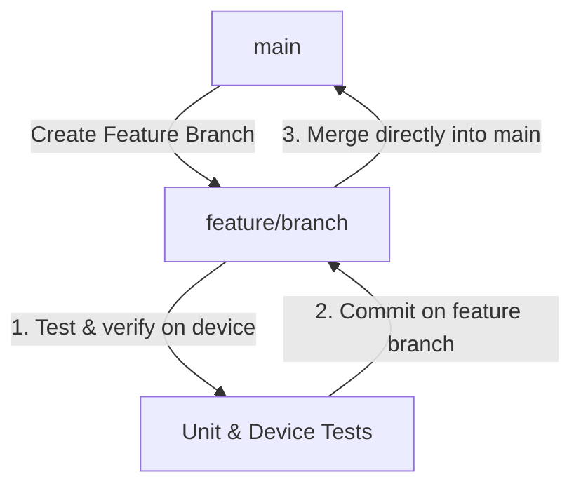

# Appace — Git Workflow & Branch Management

This document defines the workflow for managing branches, testing features, and merging changes to the stable `main` branch.

---

## 1. Branch Roles

* **`main`**: Stable, production-ready code. **Never commit directly to `main`.**
* **Feature & Fix Branches (`phase/*`, `fix/*`)**: Created off `main`, developed, tested, and verified directly, then merged into `main`.

---

## 2. Typical Feature & Testing Lifecycle



### Step 1: Create a Branch
All work starts on a branch created from `main`:
```bash
git checkout main
git pull
git checkout -b fix/my-fix-description
```

### Step 2: Test on the Branch
Run all unit tests and verify on the physical device directly on the branch:
```bash
# Run unit tests
cd android; .\gradlew test

# Verify type safety
npx tsc --noEmit
```

### Step 3: Merge Directly to `main`
Once tests pass and changes are committed, merge the branch directly into `main`:
```bash
git checkout main
git merge fix/my-fix-description
```

---

## 3. Active Working Tree Reference
Ensure that before merging or switching branches, your working tree is clean to prevent uncommitted changes from leaking:

* **To check status**: `git status`
* **To discard temporary changes**: `git restore .` (or `git stash` to save them temporarily)
